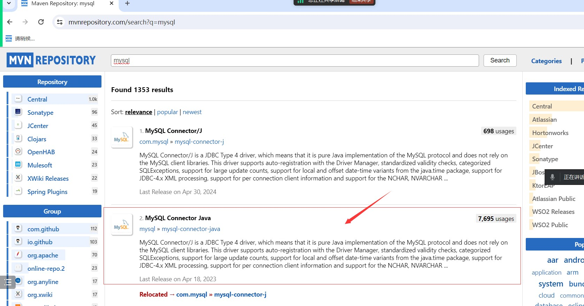

# Note 240701
## Review

### JDBC
- 流程
  - 1.加载驱动(导依赖)
    - 
    - 引号里面是驱动的位置(文件)
      - `Class.forName("com.mysql.cj.jdbc.Driver");`
  - 2.建立连接 , 获得一个连接对象
    - 对象 有三个参数: 连接地址 用户名 密码
    - `Connection  conn  =  DriverManager.getConnection("jdbc:mysql://localhost:3306/sms","root","root");`
  - 3.获得执行语句对象
    - 查询语句尽量不要用 * ,不方便维护
    - `PreparedStatement psm  = conn.prepareStatement("select sno,sname,password,sex,age from t_student");`
  - 4.获得结果
    - `ResultSet rs  =  psm.executeQuery();// 查询，获得结果集 查询`
    - `ResultSet rs  =  psm.executeUpdate()// 更新，获得执行行数 增删改都是用这个`
    - 处理集合
      - ```java
        while(rs.next()){

              System.out.println(
                      rs.getInt("sno")+","+
                      rs.getString("sname")+","+
                      rs.getString("password")+","+
                      rs.getString("sex")+","+
                      rs.getInt("age")
              );
          }
  - 5.关闭资源
    - ```java
      rs.close();
        psm.close();
        conn.close();
  - 注意: 前五步需要抛异常 最后一步需要单独抛异常
### @Data
- 自动写出 get set toString 方法

### @AllArgsConstructor 
- 自动写出 全参数构造

### @NoArgsConstructor
- 自动写出 无参构造
  
### JDBC 中的模糊查询
- 方式 1
  - `PreparedStatement psm  = conn.prepareStatement("select sno,sname,password,sex,age from t_student where sname like concat('%',?,'%') and password like concat('%', ? ,'%')");`
  - `psm.setString(1,sname); // 第一个问号的位置 `
  - `psm.setString(2,password);// 第二个问号的位置 ` 
- 方式 2 (不推荐)
  - ` PreparedStatement psm  = conn.prepareStatement("select sno,sname,password,sex,age from t_student where sname like ?");`
  - `psm.setString(1,"%"+sname+"%");`

### SQL
- 查询
  - `select * from 表名 where 条件名;`
- 插入
  - `insert into 表名(字段名) value(属性值);`
- 修改
  - `update 表名 set 属性=属性值 where 条件;`
- 删除
  - `delete from 表名 where 条件`
- `where` 条件
  - `is not null ;`  -- 是否 为非空
  - `age>=18 and age<=50   BETWEEN and`
  - `-- in  not in `
  - `like 模糊查询  _  %(0个或多个任意字符)  not like`
    - ```sql
      select * from t_student where sname ='zhw';
      select * from t_student where sname  like 'zhw';
      -- 以 z开头
      select * from t_student where sname  like 'z%';
      -- 第二位以 h开头 （第一个字符 任意 ，第二个 h 后面 随意 ）
      select * from t_student where sname  like '_h%';
      -- 以 i 结尾
      select * from t_student where sname  like '%i';
      -- 非 取反的
      select * from t_student where sname not like '%i';
- `limit` 分页
  - `-- limit  -- 常用于 分页
    -- 下标从零开始
    select * from t_student limit 2;  -- 从第零条开始 一共显示2条
    select * from t_student limit 0,2;  -- 效果同上
    select * from t_student limit 2,2;  -- 第2+1 条开始，显示2条`
- `order by   asc 升序（默认） desc 降序` 排序
  - `-- order by   asc 升序（默认） desc 降序   排序的
     select * from t_student  order by age desc
     -- 多重 排序 （在前面的排序列 相同的情况下，出现第二列继续排序）
     select * from t_student  order by age desc ,sno desc`
- 聚合函数 `count 个数    sum  总和   avg 平均值  max 最大值  min 最小值 `
  - `select count(*) from t_student;  -- 初学者用它
    select count(sno) from t_student;  -- 推荐用 主键 （非空的）
    select count(birthday) from t_student;  -- 不会统计 为空的字段`
- `group by` 分组
  - ` -- where 分组前 筛选
    -- having 分组后 筛选
    select * from t_student;
    select * from t_student; --  分组前 先把 密码为空的人踢掉
    select * from t_student where password is not null ;
    select sex,count(*) from t_student where password is not null GROUP BY sex  ;
    -- 分组后，只显示 人数 大于1 的那一组
    select sex,count(*) from t_student where password is not null GROUP BY sex  having count(*)>1;`