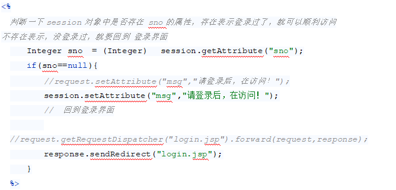

# Note 240704
## Review 

### Jsp Servlet
- request
  - 生命周期 reponse 给浏览器 , request 就不存在了
  - 
- reponse
- session
  - 关闭浏览器 session 就不存在了
  - 因为 从定向了 request 携带的数据没了 , 这里就需要session
  - 
  - 生命周期
    - 关闭浏览器
    - 重启服务器
    - 默认 30 分钟后 ( 可以通过设置 ) 失效
  - 可以实现 权限控制
    - 
- 转发 
  - `request.getRequestDispatcher("main.jsp").forward(request,response);`
- 从定向
  -  `response.sendRedirect("main.jsp");`
  