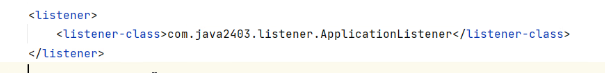

# Note 240708
## Review
  - 数据库中 
    - `SYSDATE()` 函数用于返回当前的系统日期和时间。
### session
- session 创建
  - `HttpSession session = request.getSession()`
- session 销毁
  - `session.invalidate();`

### 监听器
- 监听配置
  - 目的 : 注册为一个监听器。
    - 之前
      - 
    - 现在
      - `@WebListener`
- `contextInitialized(ServletContextEvent sce)`
  - 在 Web 应用程序启动时被调用。可以在这个方法中执行一些初始化操作
- `contextDestroyed(ServletContextEvent sce)`
  - 在 Web 应用程序关闭时被调用。可以在这个方法中执行一些清理操作，例如释放资源、保存状态等。
- 可以有多个监听器类
- 作用有多种 ,今天主要用来做持久化

### 过滤器
- 主要用于 Web 应用程序中。它们在请求到达 Servlet 之前和响应返回客户端之前进行处理。
- 多个过滤器 先进后出
  - 至于那个 先进 是看 配置 ,没做配置 就看文件名(A-Z,数字排序)正向排序
- 路径
  - 在 Java 的 @WebFilter 注解中，如果设置 value = "/*"，表示该过滤器将拦截所有的请求路径。
  - `value = "/teacher/*"` -> 只要路径中 带有 teacher 都要经过这个过滤器
- 过滤链
  - 多个过滤器可以组成一个过滤器链（Filter Chain），按顺序处理请求和响应。每个过滤器在调用` chain.doFilter(request, response) `方法后，传递控制权给链中的下一个过滤器或目标 Servlet
- 作用 有多种 今天主要用来做 权限控制