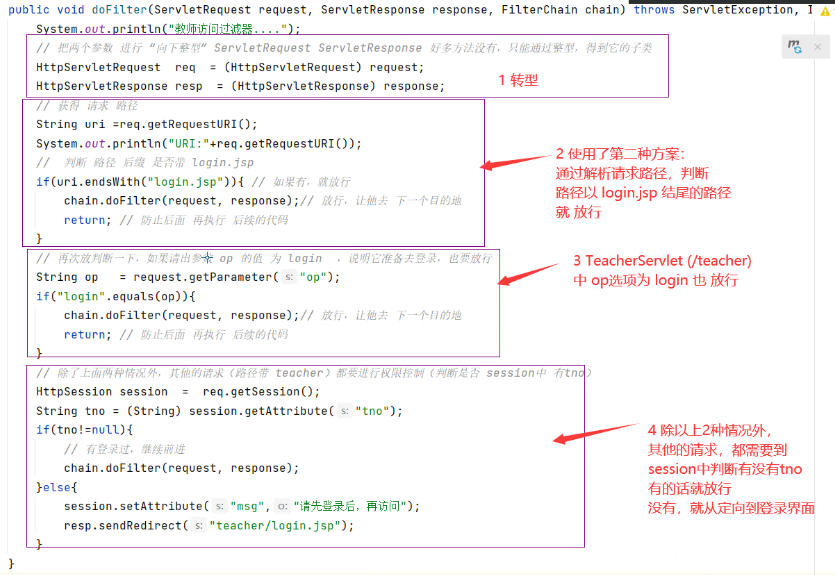

# Note 240709
## Review
- ### 监听器生命周期
  - 监听器 在 tomcat 启动时，根据相关配置，去加载的(创建的)
- ### 过滤器
  - 
  - 
  - 
  - 
### 转发 
- `dispatcher.forward(request, response);`
- 转发是服务器内部的操作，服务器将请求转发给另一个资源（如 Servlet、JSP 文件等）进行处理，而客户端（浏览器）对此过程是透明的。
- 特点 :
  - 服务器内部操作：转发是在服务器内部进行的，客户端并不知道请求被转发了。
  - URL 不变：客户端浏览器的 URL 不会改变，仍然是原始请求的 URL。
  - 共享请求和响应对象：转发过程中，原始请求和响应对象会被共享给目标资源。
  - 效率较高：由于是在服务器内部进行的操作，不需要重新向服务器发送请求，因此效率较高。
### 重定向 : 
  - `response.sendRedirect("targetPage.jsp");`
  - 重定向是服务器发送一个 HTTP 响应状态码（如 302），告诉客户端（浏览器）重新发送一个新的请求到另一个 URL。
  - 特点 :
    - 客户端操作：重定向是通过客户端重新发送请求来实现的。
    - URL 改变：客户端浏览器的 URL 会改变为重定向后的新 URL。
    - 不共享请求和响应对象：重定向后，新的请求会有新的请求和响应对象，原始请求的数据不会被传递到新请求中。
    - 效率较低：由于需要客户端重新发送请求，因此会增加一次网络往返，效率较低。