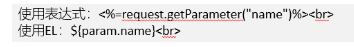
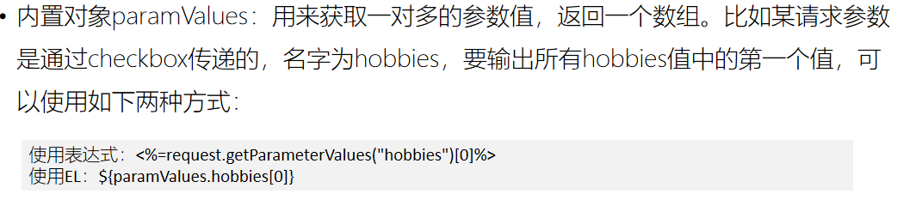
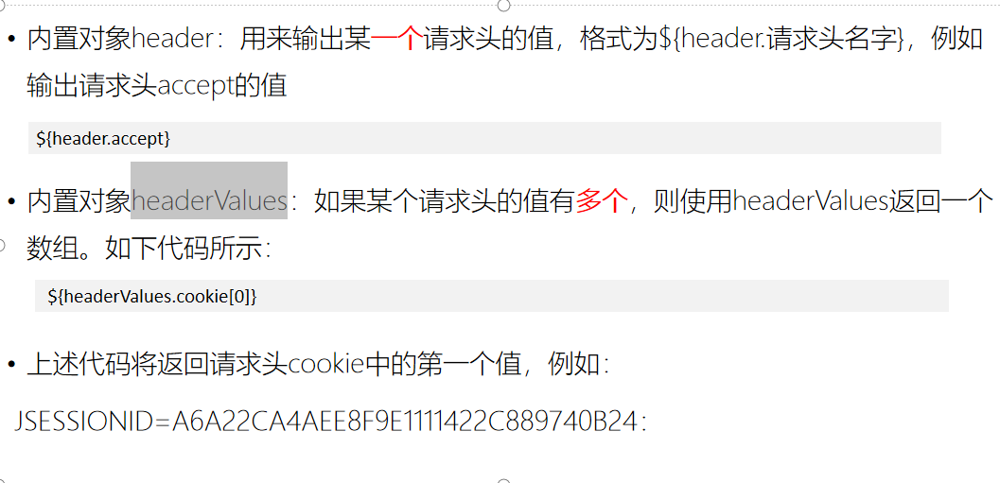
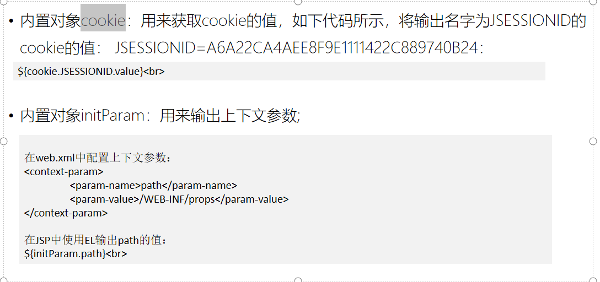
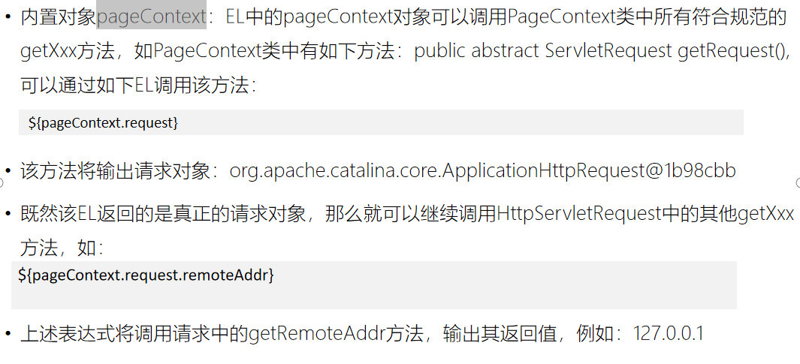
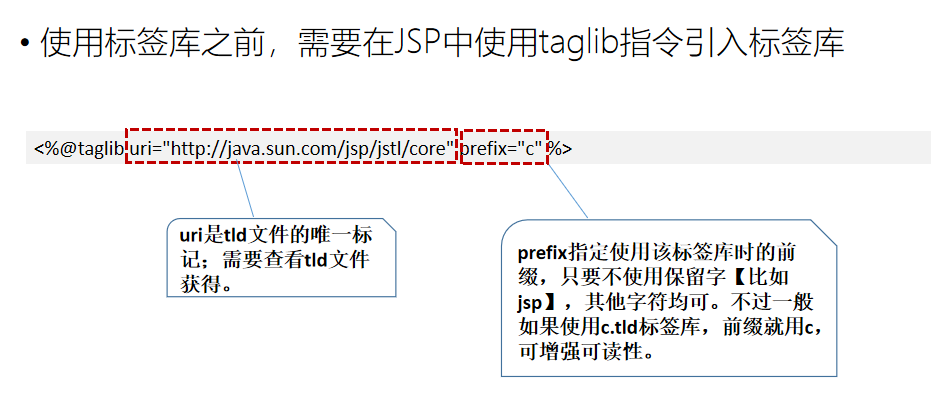
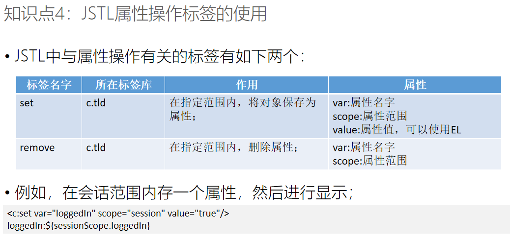

# Note 240710

## Review
- ```` java
  // 先在我们四大作用域中存数据
    pageContext.setAttribute("msg","pageContextMSG"); // 本页（超出本页范围，就失效）
    request.setAttribute("msg","requestMSG"); // 请求（一次请求一次响应后，就失效）
    session.setAttribute("msg","sessionMSG");// 会话（会话结束（1 关闭浏览器 2 关闭服务器 3 超时30分钟）后，就失效）
    application.setAttribute("msg","applicationMSG");// 上下文（服务器关闭后），就失效
## 预习
### EL
- EL在JSP中使用，服务器会对其进行解析翻译，生成相应的Java代码；
- EL的作用是用来在JSP页面输出动态内容，可以替代JSP中的表达式元素<%=%>
- 一般格式
  - 以 ${开始，以} 结束 : 
    - `${EL表达式}`
    - `${param.username}` 等同于 `<%=request.getParameter(“username”)%>`
- 内置对象
  - 
  - 数组
    - 
  - 请求头 : 
    - 内置对象header：用来输出某一个请求头的值，格式为${header.请求头名字}，例如输出请求头accept的值
      - headerValues
      - 
  - cookie
    - 
  - pageContext
    - 
- EL表达式获取数据的作用域检索顺序
- 运算符

### JSTL
- 标签库的作用
  - 在JSP中通过使用标签就可以实现动态功能，不用在JSP中编写复杂的Java代码
- JSTL简介
  - JSTL包含很多标签，根据其作用可以分为：属性相关的标签、条件分支相关的标签、迭代标签、其他标签
- JSP taglib指令标签的使用
- JSTL属性操作标签的使用
- JSTL条件分支标签的使用
- JSTL迭代标签的使用
- JSTL标签分类

### EL test 
- `EL表达式 是  $ 后面 是  花括号      区分： jquery 选择器 $()`
- `如果 属性 不是唯一的（多个作用域对象都拥有呢，找谁？）小范围 找到 大范围  ，先找到谁，就是谁`
  - ```` html
    pageContext:${pageScope.msg}<br/>  <%-- <%=pageContext.getAttribute("msg") %> --%>
    request:${requestScope.msg}<br/>
    session:${sessionScope.msg}<br/>
    application:${applicationScope.msg}<br/>
  - `msg:${msg}` ${参数名}
- 对象
  - 直接可以通过属性名 获得 数据 前提是 我们的对象必须符合 `javabean规则 (封装 属性私有、提供公共的getset方法，并且是驼峰式写法)`
  - `${my.sno}-${my.sname}-${my.password}-${my.sex}-${my.age}`
  
- 运算符
  - ```` EL
    比较运算符
    ${1==1}   ${1 eq 1}  <br/>
    ${1>1} ${1 gt 1}<br/>
    ${1<1} ${1 lt 1}<br/>
    ${1>=1} ${1 ge 1}<br/>
    ${1<=1} ${1 le 1}<br/>
    ${1!=1} ${1 ne 1}<br/>

### JSTL test
- 引入表标签库
  - `<%@taglib prefix="c" uri="http://java.sun.com/jsp/jstl/core" %>`
  - 
- 常用标签 
  - 
  - 设置标签 set
    - ````
      <c:set var="sex" value="男1"  scope="page"></c:set>
      <c:set var="sex" value="男2"  scope="request"></c:set>
      <c:set var="sex" value="男3"  scope="session"></c:set>
      <c:set var="sex" value="男4"  scope="application"></c:set>
    - 范围不写默认是 page
  - 移除标签 remove
    - ````
      <c:remove var="sex" scope="page" ></c:remove>
    - 如果没设置 范围，则移除全部范围对象的属性
- 分支结构
  - c:if 只 是   单分支分支语法
    - ````
      <c:set  var="username" value="测试" scope="request"></c:set>
      <%--  c:if 只 是   单分支分支语法   --%>
      <c:if test="${not empty username}">

      ${username}
      <script type="text/javascript">
        alert("${username}");

      </script>
      </c:if>
- items 要遍历的集合或数组 (记得加 ${}) 否则就是 普通字符串 , var 临时变量名
  - ````
    <c:forEach items="${alist}" var="a">
    ${a.ano} - ${a.aname} <br/>
    </c:forEach>