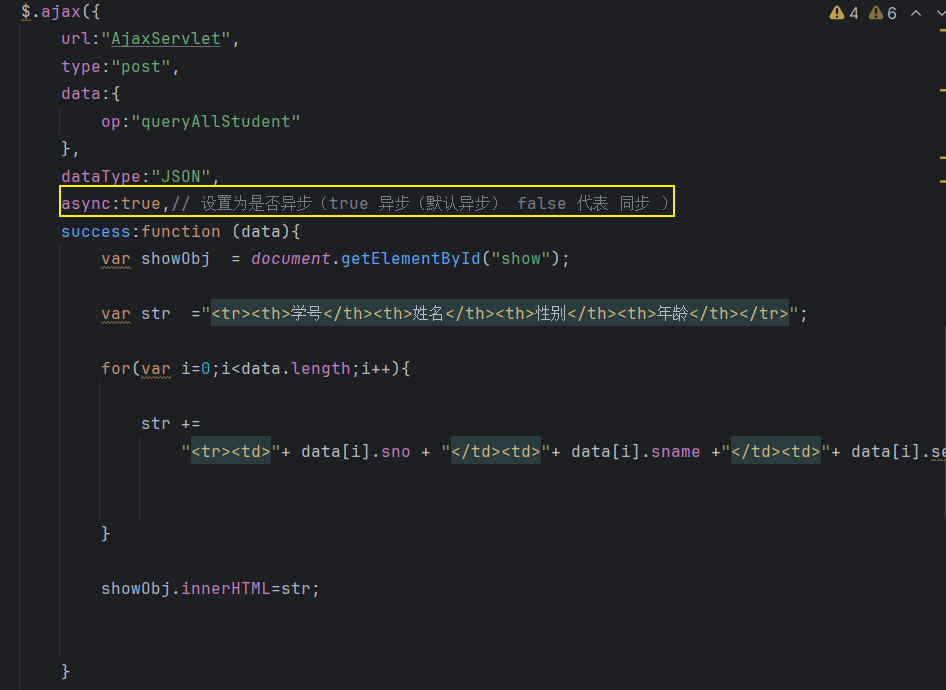
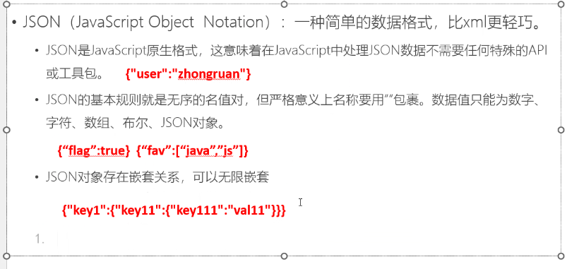

# Note 240715
## Review
- `response.getWriter()` 是 Java Servlet API 中的一个方法，用于获取 `PrintWriter` 对象，该对象可以用来向客户端（通常是浏览器）发送字符文本响应。当处理 HTTP 请求时，Servlet 可以使用 `response.getWriter()` 方法来写入响应数据。
- `document.getElementById("")` 方法用于获取 HTML 文档中具有指定 id 属性的元素。如果找到了匹配的元素，它将返回该元素的引用；如果没有找到匹配的元素，则返回 null。
- 如果找到了该元素，可以使用 innerHTML 属性来更改其内容。
  - 操作元素：通过获取元素的引用，你可以对该元素进行各种操作，例如更改其内容、样式、属性，或者绑定事件处理程序。
  - 如果找到了该元素，可以使用 innerHTML 属性来更改其内容。
    - `element.innerHTML = "Updated information!";`
### Ajax
- AJAX（Asynchronous JavaScript and XML）是一种用于创建动态和交互式网页应用的技术。它允许网页在不重新加载整个页面的情况下，与服务器进行异步通信，从而提高用户体验和应用性能。
- 主要特点
  - 异步通信：AJAX允许网页在后台与服务器进行数据交换，而无需重新加载整个页面。这意味着用户可以继续与页面进行交互，而不必等待服务器响应。
  - 部分更新：通过AJAX，可以只更新页面的一部分，而不是整个页面。这使得页面响应速度更快，用户体验更好。
  - 多格式数据：AJAX不仅可以处理XML，还可以处理JSON、HTML、纯文本等多种数据格式。
- 工作原理:
  - AJAX的工作原理主要包括以下几个步骤：
    - 1.创建XMLHttpRequest对象：在客户端（通常是浏览器）中创建一个XMLHttpRequest对象，用于与服务器进行通信。
    - 2.配置请求：通过设置请求的类型（GET或POST）、URL和是否异步等参数来配置请求。
    - 3.发送请求：将请求发送到服务器。
    - 4.接收响应：服务器处理请求并返回响应数据。客户端通过XMLHttpRequest对象的回调函数接收响应数据。
    - 5.处理响应：客户端处理服务器返回的数据，并更新网页的部分内容。
- `$.ajax();` 一个 jquery 版本的方法
  - ````
    $.ajax({
                url:"AjaxServlet",// 请求后台路径
                type:"post", // 请求类型：  get  post
                data:{//  请求参数  ?op=xxx&xxx=xxx
                    op:"test1",
                    sno:"1001",
                    sname:"庄宏伟"
                },
                dataType:"text", //返回数据类型  1 返回字符串(普通文本) text  2 返回java对象-->转换成 前端可以读得懂的文本 json
                // 后台执行完毕后，响应数据回来，我们写一个 函数 来接他的数据
                success:function(data){ // 回调函数 (data)返回的数据
                    console.log(data);
                }

            });// 一个 jquery 版本的 ajax 方法
- 同步 异步
  - 
  - 同步
    - ``````
      简单性和可读性要求高： 当操作相对简单且顺序执行更易理解时，同步操作可能更合适。比如简单的数据处理、文件读写等。

      阻塞不是问题： 当操作不会长时间阻塞程序执行时，可以考虑使用同步操作。比如一些小型计算、配置加载等。

      错误处理更直接： 同步代码中的错误处理通常更直接和易于追踪，因为错误发生时直接位于调用栈上。
      
  - 异步
    - ``````
      非阻塞操作： 当操作可能会花费较长时间，但不想阻塞程序的其他部分时，应该选择异步操作。比如网络请求、长时间的I/O操作（如文件读写、数据库查询）等。

      高并发需求： 当需要处理大量并发请求或者要求系统高效利用资源时，异步操作可以更好地满足需求，避免线程或进程的过多开销。

      事件驱动场景： 当需要响应外部事件或者事件驱动的情况下，比如GUI应用、服务器端的请求响应，异步操作通常更适合，可以有效利用事件循环机制。

      等待时间较长： 当需要等待外部资源（如远程API调用、数据库查询）响应时，使用异步可以在等待过程中继续处理其他任务，提高效率。
### JSON
- 截图笔记
  - 
  - 
