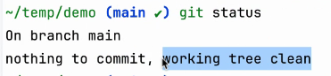
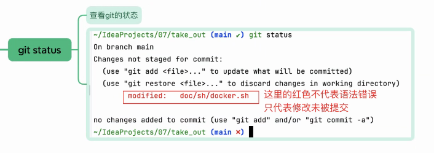
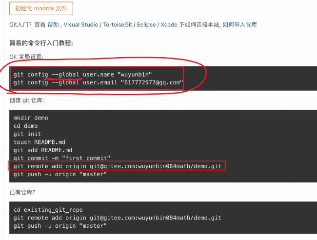
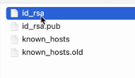

# Note for git
## git 
### 命令
- 加到暂存区
  - `git add .`
- 查看 git 状态
  - `git status`
    - 
    - working tree clean 状态才能 提交到远程
    - 
- 加到本地仓库
  - 
  - `git commit -m "modify:Demo01"`
  - 
## 远程仓库
### Gitee
- 

### 提交空文件
- 创建文件 `.gitkeep`
### pull 跟 clone 有什么区别?
- clone 是第一次 之后都用 pull

### vi 编辑器
- `shift + :`

### 私钥 公钥
- 公钥是从 私钥提取的
- 私钥 是留着本地的 不可对外公开
- 怎么生成
  - 注意 每次生成的都不一样 旧的公私钥 要保存

### 分支
- 创建 分支
- 合并 

### 冲突

### 仓库 加成员

### 使用习惯
- 小步向前

### 版本回退

### 截图寄存处
- 
- 
- 