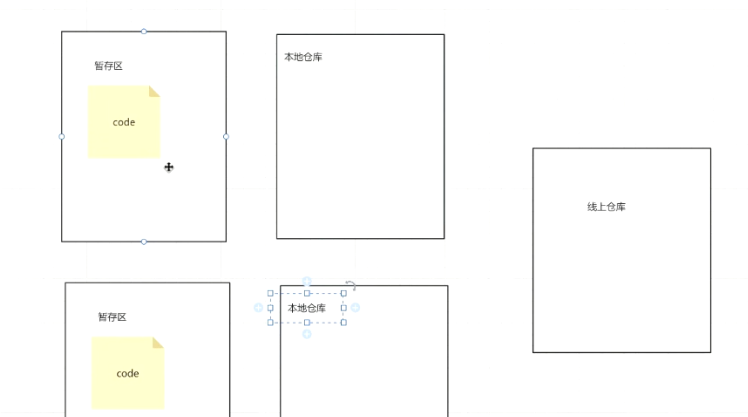
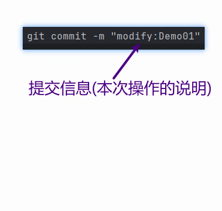
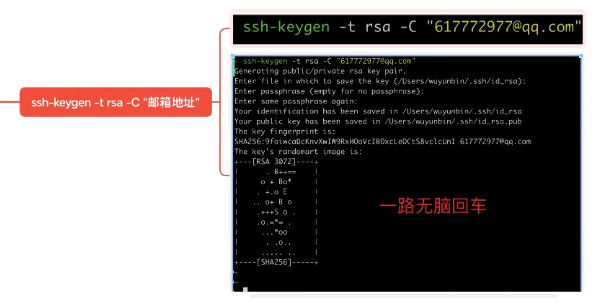
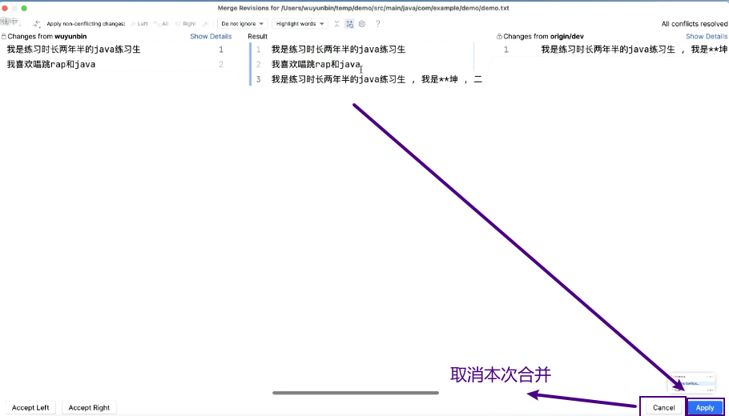

# Note for git
## git 
### 大致流程
- 
- 
### 命令
- 加到暂存区
  - `git add .`
- 加到本地仓库
  - 
  - `git commit -m "modify:Demo01"`
  - 
- 查看 git 状态
  - `git status`
    - 
    - working tree clean 状态才能 提交到远程
    - 
- 提交之前 tree clean 了 最好再拉一次代码 
  - `git pull origin main`
- 提交 代码 到远程
  - 
  - `git push origin main`
## 远程仓库
### Gitee
- 
- 关联 本地仓库和远程仓库 
  - 

### 提交空文件
- 创建文件 `.gitkeep`
### pull 跟 clone 有什么区别?
- clone 是第一次使用
- 之后都用 pull

### vi 编辑器
- `shift + :`
- `:wq` w 代表写 , q 保存退出

### 私钥 公钥
- 公钥是从 私钥提取的
- 私钥 是留着本地的 不可对外公开
  - 
- 怎么生成
  - 注意 每次生成的都不一样 旧的公私钥 要保存
  - 

### 分支
- 长命分支
  - `main` 分支 
    - 保底,代码稳定,但不是最新
  - `dev` 开发分支
    - 拉取线上代码
    - 推送本地开发的代码
    - 开发组协同
    - 代码最新,但不稳定
  - 个人分支 
    - 通常不提交到线上 
    - 真正用来做开发的
    - 在 个人分支上 解决冲突
- 创建 分支
  - `git branch 分支名`
- 切换分支
  - 输入 `git status` 如果 working tree clean 进行下一步
  - `git checkout 要切换的分支名`
- 合并  
  - `git checkout 要合并到哪个文件`
  - `git merge 要合并的内容的分支`

### 冲突
- 冲突产生的条件
  - 修改的同一个文件,同一个位置,不同的内容
- 远程 和 本地 代码冲突
  - 使用 vi 编辑器 , `:wq` w 代表写 , q 保存退出
  - 在 执行 `git status` 等操作
- 多方修改 产生冲突
  - 解决冲突
    - 方式 1
      - 
      - 
      - 
      - 
      - 再进行 `git status` 等操作
      - 
    - 方式 2
      - 

### 仓库 加成员
- 

### 使用习惯
- 小步向前
  - 个人分支开发功能 正常运行 要记得及时合并
  - 在 做 `Reset Current Branch to Here` 前 个人分支先合并到 dev ,否则会丢失 个人分支的代码
    - 
    -  

### 版本回退
- 回到目前最新版本
  - `git checkout .`

### git 忽略提交 文件
- 创建一个 `gitignore` 文件 在里面写 不提交到远程 的文件名
 
### 截图寄存处
- 
- 
- 