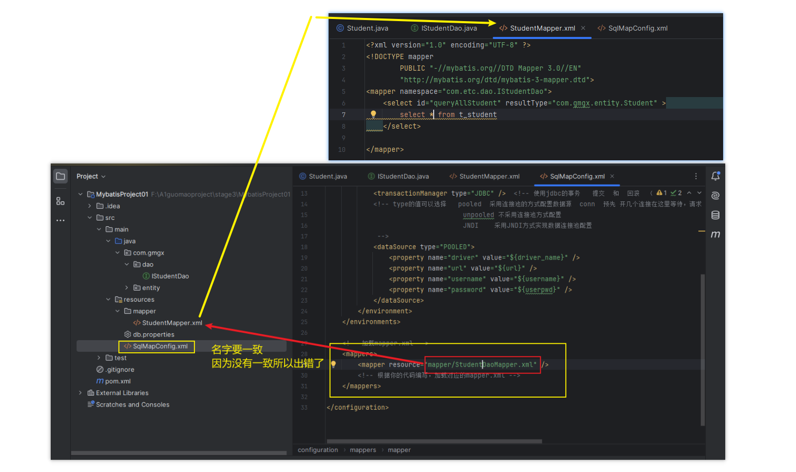

# Note 240723

## SSM
- S 
  - Spring 容器 : 作用
    1. 帮我们 new 对象 并且管理对象
    2. 整合其他框架(SpringMVC Mybatis)
- S
  - SpringMVC相当于 Servlet 控制层 比 Servlet 更好用
- M
  - Mybatis 数据库操作:dao层 持久层 实现增删查改等等

### 报错
- 